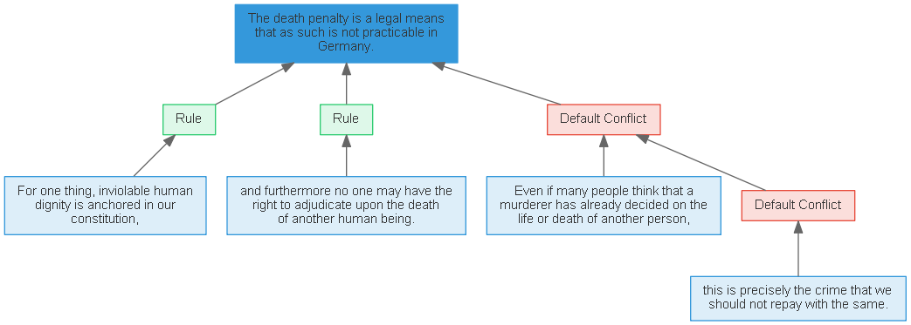
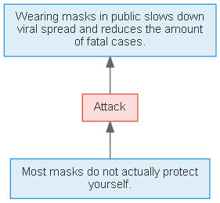

# Introduction

Many resources dealing with argumentation are available, but the content is mostly unstructured.
With its priority program _Robust Argumentation Machines_ ([RATIO](http://www.spp-ratio.de/)) the German Research Association aims at developing new methodologies to extract and process argumentative information from natural text through coherent argumentative structures rather than only considering individual facts.
As part of the priority program, the [ReCAP](http://recap.uni-trier.de/) project targets the realization of an Argumentation Machine that primarily operates on the knowledge level by enabling argument-based reasoning.

Argumentation, in a formal way, is described as a set of arguments in texts. An argument consists of a claim and at least one premise. A _claim_, which represents a controversial statement, can either be supported or attacked by one or multiple _premises_, which provide the actual evidence to a claim. Further, the _major claim_ is defined as the claim that describes the key concept in an argumentative text. Major claims, claims and premises are considered _Argumentative Discourse Units_ (ADUs) and represent the components of argumentation. Additionally, we can represent the stance between two ADUs as a supporting or attacking directed relation.

Claims, premises and the major claim are represented as _information nodes_ (I-nodes) while relations between them are represented by _scheme nodes_ (S-nodes).
The set of nodes $V = I \cup S$ is composed of _I_- and _S_-nodes.
The supporting or attacking relations are encoded in a set of edges $E \subseteq V \times V$.
Based on this, we define an argument graph $G$ as the triple $G = ( V , E , M )$.

## User Guide

First we need to import the core classes of the argument graph library: Graph, Edge, Node, NodeCategory. Additionally, our methods require Path objects as defined through the pathlib library as compared to path representation as strings.

```python
from recap_argument_graph import Graph, Edge, Node, NodeCategory
from pathlib import Path
```

Information nodes hold textual information as specific spacy objects, therefore we need to import [spacy](https://spacy.io/usage) and load a [language model](https://spacy.io/usage/models) respective to a task.

```python
import spacy
nlp = spacy.load("en_core_web_lg")
```

### Case 1: Loading a pre-existing Graph

Graphs are stored as JSON files in external formats (currently: [AIF](http://www.wi2.uni-trier.de/shared/publications/2019_Bergmann_FLAIRS.pdf?), [OVA](http://ova.uni-trier.de/)) or the internal library graph structure. A pre-built graph can be easily loaded into the environment with the following code snippet while the graph format is identified automatically.
Here, nodeset6366.json is a case graph from the [ReCAP corpus](https://www.uni-trier.de/fileadmin/fb4/prof/INF/DBI/Publikationen/preprint_dumani_corpus.pdf) and located in the root directory of the project.

```python
full_graph = Graph.open(Path("nodeset6366.json"))
```

Using the [graphviz](https://graphviz.readthedocs.io/en/stable/manual.html/) library (install & add location to PATH) we can render our graph by running the following code which produces the next image.

```python
full_graph.render(Path("fullgraph"), format='png')
```



### Case 2: Creating a new graph

We can generate graphs node by node using the argument graph library. Again, we first define a graph object.

```python
simple_graph = Graph("Covid19")
```

We create a Node object node_A and give it a list of initiating parameters key, text & category. Parameter key specifies the identifying number of a node to graph. By utilizing the keygen function of said graph we ensure that the key in unique and not already used by a different node or edge.
Parameter text can take a text object or a spacy object with the String of the actual argument it should hold. The spacy object lets us instantly make use of additional linguistic features for analysis, research or model training.
The last parameter category specifies the type of a Node object. Using the enum class NodeCategory we simply define the most common type of nodes: the information node (NodeCategory.I).

```python
node_A = Node(key = simple_graph.keygen(),
          text = nlp("Wearing masks in public slows down viral spread and reduces the amount of fatal cases."),
          category = NodeCategory.I)
```

The next Node object node_B represents a scheme node that connects two information nodes. For this simple case we define a "Attack" relation that can be represented in OVA graphs by the CA (Default Conflict) relation. We set its category accordingly (NodeCategory.CA).

```python
node_B = Node(key = simple_graph.keygen(),
          text = "Attack",
          category = NodeCategory.CA)
```

The last node node_C depicts our second information node and holds a different argument that attacks the argument defined in node_A.

```python
node_C = Node(key = simple_graph.keygen(),
          text = nlp("Most masks do not actually protect yourself."),
          category = NodeCategory.I)
```

As we can store additional information in edges of argument graphs, we need to define objects of the Edge classes that connect node C to B and B to A (direction of inference matters here).

```python
edge_CB = Edge(key = simple_graph.keygen(),
          start = node_C,
          end = node_B)

edge_BA = Edge(key = simple_graph.keygen(),
          start = node_B,
          end = node_A)
```

Finally, we need to add nodes and edges to the graph.

```python
simple_graph.add_node(node_A)
simple_graph.add_node(node_B)
simple_graph.add_node(node_C)
simple_graph.add_edge(edge_CB)
simple_graph.add_edge(edge_BA)
```

This produces the following simple graph.

```python
simple_graph.render(Path("simplegraph"),format='png')
```



### Contents

The ReCAP Argument-Graph library includes the following five base modules. The **dt** module streamlines datetime conversion when loading or exporting graphs between formats,
whereas the **utils** module provides some useful auxiliary functions. The modules **graph**, **edge** and **node** supply us with the logical data structures important to computational argumentation research.
